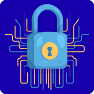

# 🔐 SMEMOPASS - Gestore Password Sicuro

**SMEMOPASS** è un gestore di password sicuro, completamente offline e gratuito. Tutti i tuoi dati sono crittografati con AES-256 e rimangono **solo sul tuo dispositivo**.

## ✨ Caratteristiche Principali

### 🔒 Sicurezza Massima
- **Crittografia AES-256** - Standard militare
- **PBKDF2** con 100.000 iterazioni
- **100% Offline** - Nessun dato inviato a server esterni
- **Password Master** - Unica chiave di accesso
- **Auto-lock** - Blocco automatico dopo inattività

### 💾 Gestione Completa
- **Sezione Password** - Gestisci username, email, URL e note
- **Memoria Digitale** - Salva IBAN, codici fiscali, documenti
- **Generatore Password** - Crea password sicure automaticamente
- **Categorie Personalizzate** - Organizza i tuoi dati
- **Ricerca e Filtri** - Trova rapidamente quello che cerchi

### 📊 Dashboard Sicurezza
- **Password Deboli** - Identifica password da aggiornare
- **Password Duplicate** - Rileva riutilizzo pericoloso
- **Password Vecchie** - Segnala password non aggiornate
- **Statistiche** - Panoramica completa della tua sicurezza

### 💾 Backup e Sincronizzazione
- **Export/Import** - Backup crittografati in formato JSON
- **Promemoria Backup** - Notifiche intelligenti dopo modifiche
- **Domanda di Sicurezza** - Aiuta a ricordare la password master
- **Multi-dispositivo** - Sincronizza manualmente tra dispositivi

### 📱 Progressive Web App (PWA)
- **Installabile** - Come un'app nativa su iOS/Android
- **Offline First** - Funziona senza connessione
- **Veloce** - Caricamento istantaneo
- **Responsive** - Ottimizzata per mobile e desktop

## 🚀 Installazione

### Opzione 1: Usa Online (GitHub Pages)
1. Visita: `https://[tuo-username].github.io/smemopass/`
2. Clicca su "Installa" nel browser
3. L'app verrà aggiunta alla tua home screen

### Opzione 2: Usa Offline (File Locale)
1. Scarica `index.html`
2. Apri il file nel browser
3. Funziona completamente offline

## 📖 Come Usare

### Prima Configurazione
1. Clicca su "Prima configurazione"
2. Crea una **password master forte** (minimo 8 caratteri)
3. (Opzionale) Aggiungi una domanda di sicurezza
4. Conferma e inizia a usare SMEMOPASS

### Gestione Password
- **Aggiungi**: Clicca "+ Aggiungi" e compila i campi
- **Genera**: Usa il generatore per password sicure
- **Copia**: Un click per copiare negli appunti (auto-cancellazione)
- **Mostra**: Visualizza temporaneamente la password
- **Modifica**: Aggiorna i dati quando necessario
- **Elimina**: Rimuovi password non più necessarie

### Backup (IMPORTANTE!)
⚠️ **Fai backup regolari!** Se perdi il dispositivo, perdi tutto.

1. Clicca "💾 Backup" nell'header
2. Salva il file JSON in un posto sicuro
3. Il backup è crittografato con la tua password master

### Importazione
1. Clicca "📥 Import"
2. Seleziona il file di backup
3. Vedrai la domanda di sicurezza come promemoria
4. Accedi con la password master del backup

## 🔑 Password Master - FONDAMENTALE

### ⚠️ ATTENZIONE
- **Se dimentichi la password master, perdi TUTTO**
- Non esiste modo di recuperarla
- Non ci sono domande di sicurezza o email di reset
- **Scrivila in un posto sicuro!**

### La Domanda di Sicurezza
- NON recupera la password (impossibile)
- Serve solo come promemoria nei backup
- Ti aiuta a ricordare QUALE password hai usato

Esempio:
- Oggi: Password "Gatto2024!" + Domanda "Nome primo animale?"
- Domani cambi: Password "Cane2025!" + Domanda "Nome secondo animale?"
- Quando importi vecchio backup → vedi "Nome primo animale?" → ricordi "Gatto2024!"

## ⚙️ Impostazioni Personalizzabili

### Sicurezza
- **Timeout Inattività**: 1-30 minuti o Mai
- **Auto-hide Password**: 5-30 secondi
- **Cancellazione Appunti**: 15 sec - 2 min
- **Promemoria Backup**: Dopo X modifiche (1-20)

### Opzioni
- Mostra indicatore forza password
- Conferma prima di eliminare
- Cambio password master con ri-crittografia

## 🛡️ Sicurezza e Privacy

### Come Funziona
1. Crei una password master
2. Viene derivata una chiave con PBKDF2
3. Tutti i dati vengono crittografati con AES-256
4. I dati crittografati sono salvati in localStorage
5. Nessuno può leggerli senza la password master

### Cosa NON viene salvato
- La password master (mai memorizzata)
- Nessun dato non crittografato
- Nessuna informazione personale identificativa

### Dati Locali
Tutti i dati sono salvati in `localStorage` del browser:
- `passwordManager_salt` - Salt per derivazione chiave
- `passwordManager_data` - Password crittografate
- `passwordManager_memoryData` - Informazioni crittografate
- `passwordManager_categories` - Categorie (non sensibili)
- `passwordManager_settings` - Impostazioni (non sensibili)

## 📱 Installazione PWA

### Android (Chrome/Edge)
1. Apri l'app nel browser
2. Tocca i tre puntini (⋮) in alto a destra
3. Seleziona "Installa app" o "Aggiungi a schermata Home"
4. Conferma l'installazione
5. L'icona apparirà nella home screen

### iOS (Safari)
1. Apri l'app in Safari
2. Tocca il pulsante Condividi (quadrato con freccia)
3. Scorri e tocca "Aggiungi a Home"
4. Modifica il nome se vuoi
5. Tocca "Aggiungi"
6. L'icona apparirà nella home screen

### Desktop (Chrome/Edge)
1. Visita l'app nel browser
2. Cerca l'icona "Installa" nella barra degli indirizzi
3. Oppure: Menu → Installa SMEMOPASS
4. L'app apparirà come applicazione standalone

## 🆘 Risoluzione Problemi

### Ho dimenticato la password master
❌ Non recuperabile. Hai perso l'accesso.
✅ **Prevenzione**: Scrivila su carta in un posto sicuro

### Ho perso il dispositivo
✅ **Soluzione**: Importa il backup su nuovo dispositivo
✅ **Prevenzione**: Backup regolari in cloud personale/USB

### Browser resettato / App disinstallata
✅ **Soluzione**: Importa il backup
✅ **Prevenzione**: Backup in 2-3 posti diversi

### Ho cambiato password e i backup vecchi non funzionano
✅ **Soluzione**: Guarda la domanda di sicurezza nel backup
✅ **Prevenzione**: Backup PRIMA e DOPO il cambio password

### Errore "Cannot decrypt"
❌ Password master errata per questo backup
✅ Verifica la domanda di sicurezza del backup

## 💡 Best Practices

### Setup Iniziale
1. ✅ Password master FORTE (lettere, numeri, simboli)
2. ✅ Scrivila su carta → cassaforte/cassetto sicuro
3. ✅ Imposta domanda di sicurezza utile
4. ✅ Fai primo backup subito

### Uso Quotidiano
1. ✅ Password uniche per ogni account
2. ✅ Usa il generatore (lunghezza 16+)
3. ✅ Controlla dashboard regolarmente
4. ✅ Aggiorna password deboli/duplicate

### Manutenzione
1. ✅ Backup ALMENO mensili
2. ✅ Backup in 2-3 posti (USB + cloud + disco)
3. ✅ Testa i backup periodicamente
4. ✅ Cambia password importanti ogni 6-12 mesi
5. ✅ Dopo cambio password master → backup IMMEDIATO

### Cosa NON Fare
1. ❌ Password ovvie tipo "password123"
2. ❌ Stessa password per più account
3. ❌ Salvare password master sul dispositivo
4. ❌ Condividere password master
5. ❌ Usare su computer pubblici

## 🔧 Tecnologie Utilizzate

- **HTML5** - Struttura
- **CSS3** - Styling responsive
- **JavaScript (ES6+)** - Logica applicazione
- **Web Crypto API** - Crittografia
- **localStorage** - Persistenza dati
- **Service Worker** - Funzionalità offline
- **PWA** - Progressive Web App

## 📄 Licenza

Questo progetto è rilasciato come open source. Puoi usarlo, modificarlo e distribuirlo liberamente.

## 🤝 Contributi

I contributi sono benvenuti! Se trovi bug o hai suggerimenti:
1. Apri una Issue su GitHub
2. Proponi una Pull Request
3. Contatta lo sviluppatore

## ⚠️ Disclaimer

SMEMOPASS è fornito "così com'è" senza garanzie. Gli sviluppatori non sono responsabili per:
- Perdita di dati
- Password dimenticate
- Problemi di sicurezza derivanti da uso improprio
- Danni di qualsiasi natura

**Sei responsabile di:**
- Ricordare la password master
- Fare backup regolari
- Proteggere il tuo dispositivo
- Usare password forti

## 📞 Supporto

Per domande, problemi o suggerimenti:
- 🐛 Apri una Issue su GitHub
- 📧 Contatta via email
- 📖 Consulta le istruzioni nell'app (pulsante "❓ Aiuto")

---

**Sviluppato con ❤️ per la privacy e la sicurezza digitale**

**SMEMOPASS - La tua cassaforte digitale locale** 🔐
